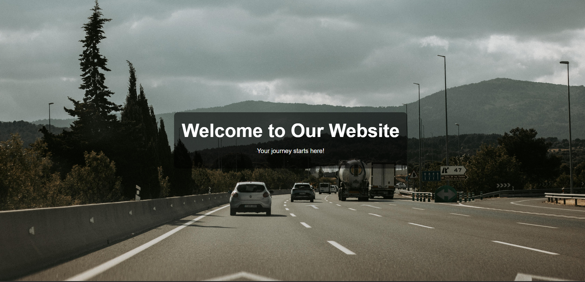
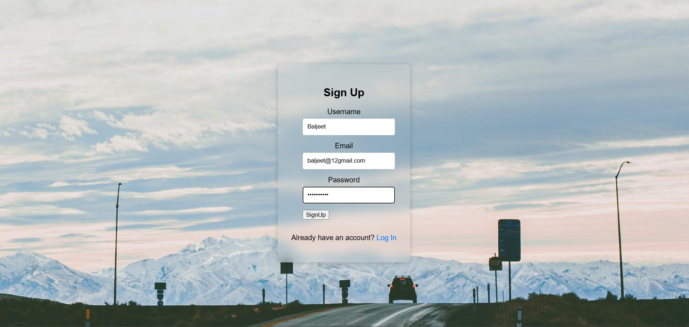
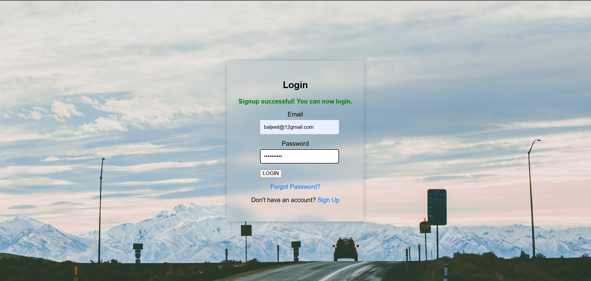
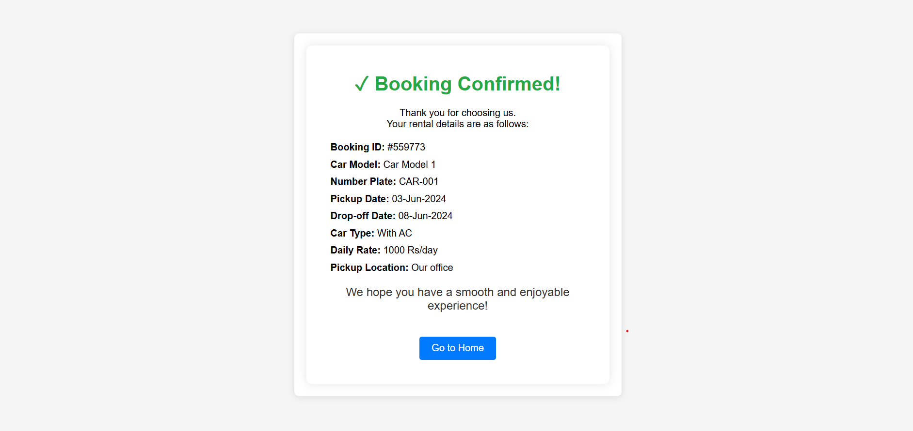

# Automobile Rental System

A clean and user-friendly PHP web application built for automobile rental booking. This project includes car and bike rental listings, signup/login, and booking confirmation pages — all designed to feel like a real rental service.

## Features

- ✅ Responsive home page with car and bike listings
- ✅ User signup and login system
- ✅ Booking pages for 3 car models and 3 bike models
- ✅ Dynamic booking confirmation with pickup and drop-off dates
- ✅ Database integration using MySQL
- ✅ Contact section with real company details

## Screenshots

### Home Page



### Signup Page



### Login Page



### Car Listings


### Bike Listings


### Booking Confirmation


### My Bookings



## Pages Included

- `index.php` - Public homepage
- `signup.php` - User registration
- `login.php` - User login
- `indexlogin.php` - Logged-in dashboard
- `car1.php`, `car2.php`, `car3.php` - Car rental pages
- `bike1.php`, `bike2.php`, `bike3.php` - Bike rental pages
- `bookingcar1.php`, `bookingcar2.php`, `bookingcar3.php` - Car booking confirmation pages
- `bookingbike1.php`, `bookingbike2.php`, `bookingbike3.php` - Bike booking confirmation pages
- `mybookings.php` - Booking history page
- `aboutus.php` - About us page

- `index.php` - Public homepage
- `signup.php` - User registration
- `login.php` - User login
- `indexlogin.php` - Logged-in dashboard
- `car1.php`, `car2.php`, `car3.php` - Car rental pages
- `bike1.php`, `bike2.php`, `bike3.php` - Bike rental pages
- `bookingcar1.php`, `bookingcar2.php`, `bookingcar3.php` - Car booking confirmation pages
- `bookingbike1.php`, `bookingbike2.php`, `bookingbike3.php` - Bike booking confirmation pages
- `mybookings.php` - Booking history page
- `aboutus.php` - About us page

## Setup Instructions

1. Install **XAMPP** or another PHP web server.
2. Place the project folder inside the web server root (`htdocs` for XAMPP).
3. Start **Apache** and **MySQL** from XAMPP Control Panel.
4. Open `http://localhost/automobile/index.php` in your browser.
5. Make sure the database `rental_system` exists and is connected in `connection.php`.

## Database Setup

The project uses MySQL. Create the database with:

```sql
CREATE DATABASE IF NOT EXISTS rental_system;
```

The connection file is:

```php
$host = 'localhost';
$user = 'root';
$pass = '';
$db = 'rental_system';
$con = mysqli_connect($host, $user, $pass, $db);
```

## Notes

- This project was created by me and styled to look like a real automobile rental booking experience.
- Update `connection.php` if your MySQL credentials differ.
- Do not commit database credentials or production secrets.

## Contact

- **Email:** baljeetydv0001@gmail.com
- **Phone:** 6206007224

---

Created with care for a real rental system demo.
